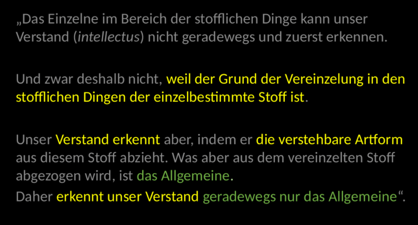

# Thomas von Aquin

Versuch der Vereinbarung zwischen Philosophie und Theologie

Philosophie als Tätigkeit der Vernunft/des Verstandes als Erkenntnis von sich selbst und von materiellen Dingen

* Was erkennt unser Verstand an den materiellen Dingen?
  * Das Einzelne?
  * Unendlich Vieles?
  * Zufälliges?
  * Zukünftiges?

* Wie erkennt die Seele sich selbst und das, was in ihr ist?
  * Sich selbst durch ihre Wesenheit?
  * Wie erkennt sie die vorhandenen habituellen Eigenschaften?
  * Wie erkennt der Verstand seinen eigenen Akt?
  * Wie erkennt sie den Akt des Willens?

**Intellektus vs Ratio**

* Einsicht (intellectus) bezeichnet die einfache und absolute Erkenntnis zu bezeichnen. In der Sache selbst liegt die Wahrheit, die gelesen wird.
* Schließendes Denken (ratio) bezeichnet ein Fortschreiten, wodurch die menschliche Seele von einem aus zur Erkenntnis von etwas anderem vordringt oder gelangt.

>Einsicht als Ausgangspunkt des Vernunftverfahrens im Hinblick auf den Weg des Forschens, als Ziel im Hinblick auf den Weg des Urteilens.

**Erkennt unser verstand das einzelne?**

Pro: Was die niedere Kraft kann, kann die höhere, aber der Sinn erkennt das Einzelne, also umso viel mehr der Verstand

Contra: Aristoteles "Das Allgemeine ist für die Vernunft bekannt, das Einzelne aber für den Sinn."

Conclusio: Man müsse sagen, dass unser Verstand das Einzelne in den materiellen Dingen nicht unmittelbar und ursprünglich erkennen kann.

**Kann unser Verstand unendlich vieles erkennen?**

* In den materiellen Dingen gibt es kein aktuell, sondern nur ein potenziell unendliches. Deshalb findet sich in unserem Verstand ein potenziell Unendliches. Aktuell aber oder habituell kann unser Verstand nicht unendlich vieles denken.

**Kann der Verstand zufälliges erkennen?**
* So wird folglich das Zufällige, sofern es zufällig ist, unmittelbar zwar durch den Sinn, mittelbar aber von dem Verstande erkannt, die allgemeinen und notwendigen Momente des Zufälligen aber werden mit dem Verstand erkannt.

Vermögen (Verstand) -> Akt (Erkennen) -> Objekt (stoffliches Ding)
