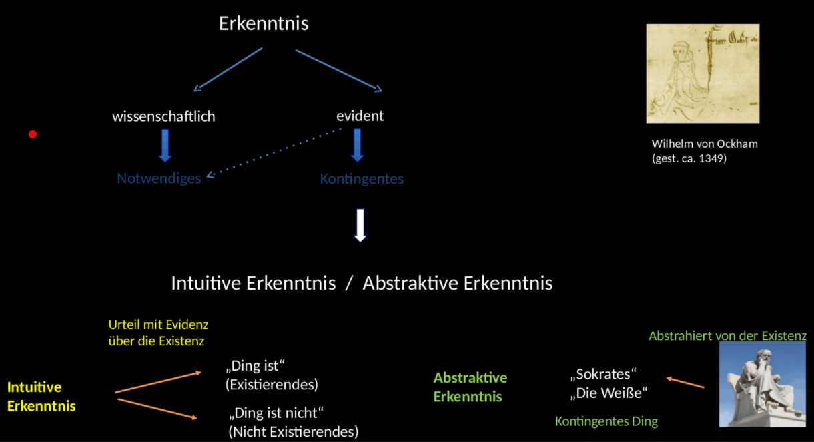
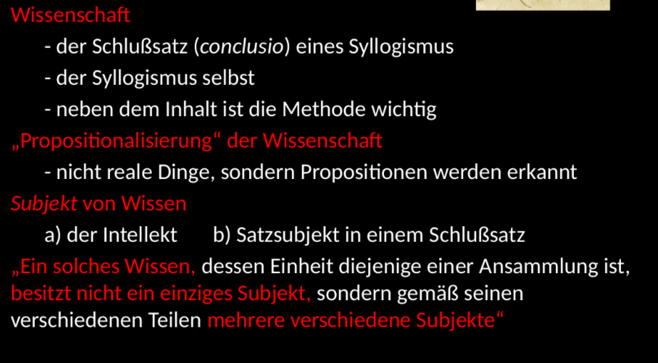

# Ockham

Begriffe und die Möglichkeit der intuitiven Erkenntnis des Einzelnen

Ockhams Razor: keine unnötige Reduplikation in Systemen

Intuitive Erkenntnis als Urteil mit Evidenz

Abstraktive Erkenntnis - Von Statue des Sokrates auf Person Sokrates abstrahieren

Selbst wenn ich erkenne, dass etwas nicht existiert habe ich 'positive Erkenntnis'

Unterschiedliche Erkenntnisweise unterscheiden sich nicht im Bezug auf Gegenstände oder Ursachen, sondern durch sich selbst.

Dadurch ist sowohl sinnliche als auch geistig intuitive Erkenntnis eine nichtexistierenden Dinges möglich.

Intuitive Erkenntnis kann sowohl sinnlich als auch geistig sein.

Sternbeispiel:

Wenn ich einen Stern

Wissen als

* gewisse Erkenntnis von etwas wahrem
* evidente Erkenntnis (führt dazu, dass auch zufälliges 'Wissen' sein kann)
* evidente Erkenntnis eines Notwendigen Wissens
* evidente Erkenntnis des Notwendigen und wahren gemäß des syllogistischen Diskurs
* evidenter Schlussatz, manchmal für die ganze Erkenntnis des Beweises
* die Hauptbestandteile, die Metaphysik sei ein Wissen und die Naturphilosophie sei Wissen

1. Ockam beweist gegen Aquin die Faktizität einer Intellektiven Erkenntnis des Einzelnen
2. Ockham erklärt die Erkenntnisweise als eine intuitive Erkenntnis, denn diese allein vermag kontingente Sachverhalte zu erfassen.
3. Alle menschliche Erkenntnis fängt mit der Intuition des Einzelnen an.

Ockhams Antwort auf Duns Scotus
* Erstens: die intuitive und die abstraktive Erkenntnis unterscheiden sich nicht derart, dass die abstraktive unterschiedslos ein Existierendes und ein Nicht-Existierendes, ein Gegenwärtiges und ein Nicht-Gegenwärtiges zum Gegenstand haben kann, die intuitive hingegen nur ein Existierendes oder Gegenwärtiges. Diesen Unterschied nehmen einige überall dort an, wo sie von diesem Thema spreche.

* Zweitens unterscheiden sich die beiden Erkenntisse auch nicht, weil die abstraktive Erkenntnis das Objekt nicht in sich gemäß seiner vollkommenen Bestimmtheit, sondern nur in einer verminderten Ähnlichkeit erreicht; die intuitive Erkenntnis hingegen erreicht, ihr Objekt in sich selbst, gemäß seiner vollkommenen Bestimmtheit.

Ockam: 'Ich erkenne' wird mit evidenz erkannt

  * Aussage hat ihren Ursprung in einer unverknüpften Erkenntnis der Termini oder Dinge
  * Ähnlich wie bei Descartes (cogito), nicht aus Syllogismus sondern aus evidenz geschlossen

Die intuitive Erkenntnis des Denkaktes gefordert. Desgleichen Erhellt, dass jene kontingenten Wahrheiten bezüglich durch den Intellekt Erfassbarem mit der größten Evidenz erkannt werden, sodass wer von ihnen eine Erkenntnis besitzt, wie z.B. vom eigenen Glauben, daran nicht zweifeln kann.

**Suppositionslehre**

* Personale Supposition: wenn der Terminus für sein Bedeutendes steht. "Ungeachtet desse, ob dies nun ein extramentales Ding, ein Laut, eine Intention der Seele, ein Schriftzeichen oder irgend etwas Vorstellbares sei."
* Einfache Supposition: "Wenn der Terminus für eine Intention der Seele supponiert, aber nicht signifikativ verwendet wird."
* Materiale Supposition: "Wenn der Terminus nicht signifikativ supponiert, sondern für den Laut oder das Schriftzeichen steht."
