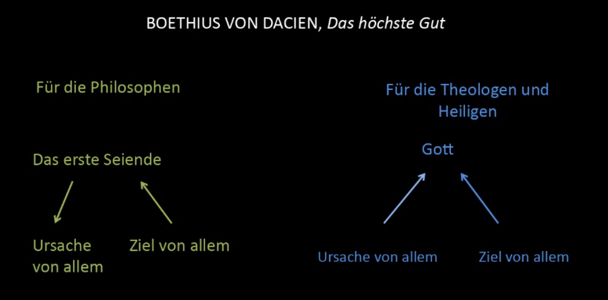

# Boethius von Dacien - Das höchste Glück

## Kontext

Stefan Tempier stellt in Paris mehr als 170 thesen verurteilt, darunter:

* Die Glückseligkeit wird in diesem Leben besessen, nicht in einem anderen

Philosophie als Dienst anderer Wissenschaften, besonders Theologie

Boethius von Dacien möchte Glückseligkeit mit vernünftigen Argumenten begründen (radikaler Aristotelismus)

Propädeutikum als Einführung in ein Gebiet vor dem wissenschaftlichen Arbeiten

Philosophie als Basis für mehrere Wissenschaften (Recht, Medizin, Theologie)

**Artes liberales (Uni in Paris)**

Trivium: Grammatik, Rhetorik, Dialektik
Quadrivium: Arithmetik, Geometrie, Musik, Astronomie

## Äußerungen

Dreiteilung des 'Menschen': **vegetativ, sensuell, intellektuell**

* Menschen haben ein höchstes gut, welches nicht das maximale Gut an sich ist, der Mensch ist beschränkt

* Das höchste Gut für den Menschen kann durch Vernunft erforscht werden

* Die beste Kraft im Menschen ist der Verstand und die Vernunft

* Also kommt das höchste Gut, das dem Menschen möglich ist, ihm zu gemäß der Vernunft

**Theorie vs Praxis**

* Das höchste Gut ist gemäß dem Vermögen der theoretischen Vernunft die Erkenntnis des Wahren und die Freude daran (Erkennen des Wahren/Guten)

* Das höchste Gut ist gemäß dem Vermögen der praktischen Vernunft das Bewirken des Guten und die Freude daran (Umsetzung des Guten)

Daher: Das höchste Gut ist die Erkenntnis des Wahren und das Bewirken des Guten sowie die Freude an beiden.

Glückseligkeit als Tätigkeit der Seele gemäß der ihr wesenhaften Tüchtigkeit

**'Das höchste Gut als letztes Ziel'**

Wenn ein Mensch entsprechend seiner Natur handelt, muss er dem Ziel näher kommen.

Ordnung der Kräfte - Ernährung > Wahrnehmung > Erkenntnis (auf einander aufbauend, Erkenntnis als höchstes Gut, die andere Schritte voraussetzt)

Mensch hat gewisses Potential zur Suche von Erkenntnis und er sollte diesem Potential nachgehen; das ist der Weg des Guten

"Philosoph ist jeder Mensch, der nach der Ordnung der Natur lebt und das Beste und letzte Ziel des menschlichen Lebens erreicht hat"

"Alle Menschen streben von Natur aus nach Wissen" (Aristoteles)

Aristoteles zuerst verboten, jedoch allmählich wurde gemerkt, dass seine Lehre kompatibel mit der Kirchlichen Lehre war; deshalb oft von mittelalterlichen Philosophen und Theologen zitiert.

Erkenntnis der Höchsten Gründe der Dinge führt zu Erkenntnis der ersten Ursache (Erkenntnis ihres Grundes; 'Sinn des Lebens')

