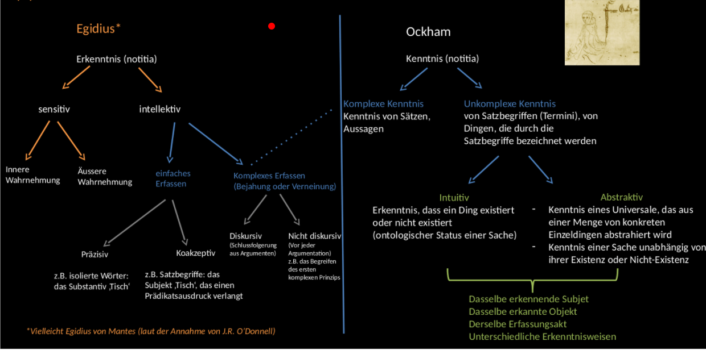
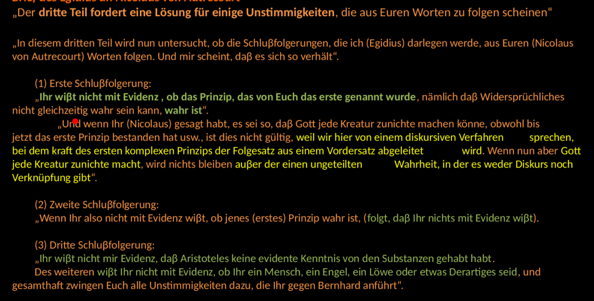
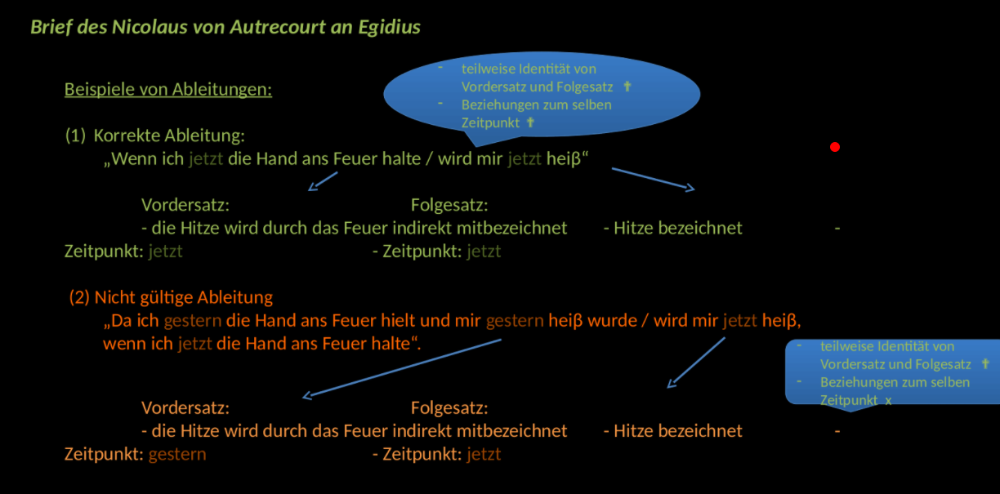

# Autrecourt

Berücksichtigung der Tradition
  * Widerspruchsprinzip, Gegensätze können nicht wahr sein

Kritik der Tradition
  * Nur logische Ansätze werden anerkannt (Syllogismus)
  * Keine Evidenz von einem Ding kann aus einem anderen Ding gewonnen werden

Kritische Auseinandersetzung mit Arezzo
-> Kritik des Skeptizismus, stellt Kausalität und Induktionsprinzip in frage

Ockam: 'Gott kann den Menschen eine intuitive Kenntnis geben, ohne dass ein Wahrnehmungsakt erforderlich ist.'

**Brief 1**

Bernhard von Arezzo (von Autrecourt abgeleitet):
1. Wir urteilen aufgrund der klaren, intuitiven Erkenntnis, dass ein Ding existiert, mag dieses Ding nun wirklich existieren oder nicht.
2. Was erkannt wird, kann existieren oder nicht existieren; was nicht erkannt wird, kann existieren oder nicht existieren.
  * Es ist möglich, dass wir Nicht-Existierendes als existierend erkennen können.
  * Graben zwischen der wirklichen und der erkannten Existenz der Dinge
3. Die intuitive Erkenntnis fordert nicht notwendigerweise, dass ein Ding existiert
4. Jegliches Phänomen, dass wir von äußeren Gegenständen haben, kann trügerisch sein
5. Wir können nie gewiss sein, wann unser Phänomen von einem Gegenstand richtig oder falsch ist, weil das Phänomen ein Ding in gleicher Weise als existierend zeigt, ob das Ding existiert oder nicht.
6. Wir haben sowohl von den äußeren Gegenständen, wie von unseren eigenen Akten keine Gewissheit

Um skeptische These abzuschwächen trifft Arezzo zwei unterscheidungen.

1. Unterscheidung zw. natürlich und übernatürlich
  * Wir erkennen ein Objekt weil es wirklich vorhanden ist
  * oder weil gott in uns eine Wahrnehmung (scheinwahrnehmung) bewirkt, obwohl kein Objekt vorhanden ist.
2. Vollkommene vs unvollkommene intuitive Erkenntnis eines nicht-existierenden Dinge

Einwand 5: Die Ableitung vom Vordersatz auf Folgesatz muss immer formal gültig sein.

Einwand 6: Gegenposition zu Arezzo, um den Skeptizismus zu entgehen, wir sind doch der Gegenstände der äußeren/inneren Wahrnehmung gewiss (mit Evidenz)

**Brief 2**

Autrecourt: Darstellung der eigenen Position

* formallogischer Ansatz, streng logisch ausgerichtete Position
* Grundprinzip der Widerspruchsfreiheit

* Keine evidente Erkenntnis von materiellen Objekten, aber nur eine wahrscheinliche Kenntnis
* Keine evidente, keine wahrscheinliche Erkenntnis von immateriellen Objekten
* Aristoteles hat keine Sicherheit, dass die Termini 'Substanz', 'Akzidens' Dingen oder Sachverhalten entsprechen

* Widersprüchliches kann nicht zugleich wahr sein.
  * nichts geht ihm voraus
  * es geht jedem anderen voraus
  * Ein Widerspruch ist die Bejahung und Verneinung ein und desselben

1. Die Gewissheit der Evidenz, die im natürlichen Licht besteht, ist eine Gewissheit in uneingeschränkter Weise. Durch keine Macht könnte es geschehen, dass das Gegenteil des Folgesatzes gleichzeitig mit dem Vordersatz gelten könnte, so wie keine Macht bewirken kann, dass Gegensätzliches wahr ist.
2. Die Gewissheit der Evidenz hat keine Grade
3. Abgesehen von der Gewissheit des Glaubens gibt es keine außer der Gewissheit des ersten Prinzips.
4. Eine syllogistische Form wird unmittelbar auf das erste Prinzip zurückgefürht.
5. Bei jeder Ableitung durch unmittelbare Rückführung auf das erste Prinzip sind der Folgesatz und der ganze Vordersatz oder ein Teil jenes Vordersatzes wirklich identisch.
6. Bei jeder evidenten, auf das erste Prinzip rückführbaren Ableitung mit beliebig vielen Zwischenstufen ist der Folgesatz wirklich identisch mit dem Vordersatz oder mit einem Teil des durch den Vordersatz Bezeichneten.

Keine Evidenz von einem Ding kan aus einem anderen Ding gewonnen werden (durch logischen Ansatz, art Syllogismus)

## Kritik des Egidius an Autrecourt

- Autrecourt weiß nicht mit Evidenz, ob das Prinzip der Widerspruchsfreiheit wahr ist
- Autrecourt weiß gar nichts mit Evidenz
- Ermangelung eines sicheren Fundaments

"Egidius versucht zu zeigen, dass die auf absolute Evidenz beharrende, logisch-empiristisch orientierte Lehre des Nicolaus, die als Gegenposition zum Skeptizismus entstand, genau zum Skeptizismus führt."

Vgl. Autrecourt und Descartes

Beide stellen die Evidenz für einen Körper infrage - wir können getäuscht werden.

Descartes stellt auf, dass er sich über seinen Geist/Verstand sicher sein kann

1. Erster Teil wiederholt eure Worte, nicht in ihrem ganzen Umfang, sondern das, was für das Thema ausschlaggebend ist
  * Aufgrund dessen, dass die Existenz eines Dinges erkannt wird, kann nciht auf evidente Weise - mit der auf die Gewissheit des ersten Prinzps rückführbaren Evidenz - abgeleitet werden, dass ein anderes Ding existiert.
  * Aristoteles hat keine evidente Kenntnis von immateriellen Substanzen gehabt, weil das immaterielle noch weniger gesehen wird.
  * Aristoteles hat in seiner ganzen Naturphilosophie und Metaphysik kaum evidente Erkenntnis von zwei Schlussfolgerungen gehabt, und vielleicht nicht einmal von einer

2. Antwort in anderer Weise darauf.

 

* Die evidente Gewissheit besitzt Grade
* Aus einem Ding kann ein anderes abgeleitet werden, wenn ein koakzeptives Erfassen vorliegt
* Die Veränderung der Sachverhalte bedingt die Existenz eines Subjektes (dessen Substanz als Kern stabil bleibt)
* Gewissheit von möglichen Sachverhalten ergibt sich aus der theoretischen Betrachtung von Tatsachen, ohne dass diese Tatsachen wirklich existieren müssen.
* Gewissheit über Faktisches (isolierte dinge - präzisiv; relative dinge - koakzeptiv)

**Grade der evidenten Gewissheit**

1. Es gibt nämlich ein erstes Prinzip, von dessen Evidenz die Evidenz der übrigen abhängt. Zahlreich aber sind die Schlussfolgerungen von deren Evidenz die Evidenz anderer abhängt. Also hat die Gewissheit der Evidenz Grade

  * Die Rückführung einer Schlussfolgerung auf ein besser bekanntes Prinzip beseitigt die Abhängigkeit von jenem Prinzip nicht. Also bleibt sie immer weniger evident als das erste Prinzip.
  * Aber die intuitiv erscheinenden Dinge haben Grade in ihrer Erscheinung und Evidenz, wie es dem Sinnesorgan erscheint. Also hat auch die Gewissheit der Evidenz Grade.
  * Wer einen schärferen Gesichtssinn hat, sieht die Farbe evidenter. Also hat die Gewissheit der Evidenz Grade
  * Ein und der selbe sieht manchmal eine Farbe klarer und manchmal weniger klar
  * Auch wenn es möglich wäre, dass gewisse Schlussfolgerungen gleich unmittelbar auf das erste Prinzip zurückgeführt werden, widerspräche dies nicht der Tatsache, dass ein Teil der Satzbegriffe doer des Intellekts evidenter ist als ein anderer. Das Abhängige bleibt auch nach der Rückführung weniger evident als jenes Prinzip, von dem es abhängt.
  * Zum Argument, indem geleicht wird, dass Aristoteles keine evidente Kenntnis von einer Substanz gehabt hat sage ich, Wenn man fragt, ob Aristoteles jene Kenntnis von dem Diskurs oder infolge des diskurses gehabt habe, dass er diese Kenntnis auf beide Arten gehabt hat. Aristoteles hat durch den Diskurs evidente Kenntnis von jenen Substanzen gehabt.

2. Aus einem Ding kann ein anderes abgeleitet werden, wenn ein koakzeptives Erfassen vorliegt.
  * Die beziehung ist beispielsweise eine vom Satzbegriff verschiedene Sache, dennoch kann sie nicht vollkommen erfasst werden, wenn nicht der Satzbegriff gleichzeitig begriffen wird, weil es nämlich das Sein der Beziehugn ist, sich zu anderem zu verhalten.
  * Zum zweiten Argument sage ich: Wenn alle Phänomene von jedem Diskurs von natürlichen Ursachen in Existenz gesetzt und darin bewahrt werden, wird dort notwendigerweise eine Substanz abgeleitet; durch keine Macht könnte dies beeinträchtigt werden, obwohl dies nicht folgt: Das Akzidenz ist auf übernatürliche Weise von einer wirkenden Ursache in Existenz gesetzt worden. Also ist dieses selbst in der Substanz. Akzidenzen auf übernatürliche Weise würden einen Widerspruch ergeben.
3. (3/4) Die natürliche Veränderung bedingt ein Subjekt aufgrund derselben Überlegung
  * Über die dritte Schlussfolgerung muss man sich unvergleichbar mehr wundern, weil Ihr einem so großen Philosophen Unwissen unterstellt und damit schlecht Ableitet. Er konnte viele Schlussfolgerung über Akzidenzien wissen, so wie er dies in der Tat auch wusste.
  * Jede Ortsbewegung zieht eine Aufeinanderfolge nach sich (auf das erste Prinzip zurückzuführen)
  * Keine lineare, einheitliche Bewegung ist ewig, weil jede solche Bewegung einen Anfang und ein Ende hat.
  * Sokrates und Platon sind in der Zahl nach verschieden

5. Nach dieser Art bedingt das Akzidens, das nicht auf wundersame Weise, sondern von einer natürlichen Ursache in Existenz gesetzt und bewahrt wurde, dass ein Subjekt existiert bzw. dass eine Substanz besteht.

 

## Brief von Autrecourt an Egidius

* Auch wenn mir nicht scheint, dass durch das was Ihr sagt, jenes, das ich geschrieben habe, aufgrund eures Einwandes aufgelöst wird, so will ich doch in meinem Zweifel zu euren Ausführungen einige Gegenargumente vorbringen.

* Bei einer korrekten Ableitung muss der Folgesatz um zu bezeichnenden mit dem Vordersatz oder mit einem Teil des durch den Vordersatz bezeichneten identisch sein muss.

* Autrecourt widerspricht nicht, präzisiert nur und sagt 'einfaches Erfassen ist vereinbar mit Autrecourts theorie'

* Wenn ein Vordersatz bezeichnet, dass 2 Dinge existieren, wird aus dem Vordersatz ein Folgesatz abgeleitet
* Wenn der Folgesatz ein Teil von jenen ist, ist die Ableitung notwendig (wenn nicht, ist sie nicht gültig)
* Folglich darf nicht gesagt werden, dass aus einem Ding ein anderes abgeleitet wird.
* Die natürliche Veränderung ist der Erwerb eines Dinges in einem Subjekt mit der Zerstörung des früheren Dingen in demselben Subjekt. Und dann gebe ich zu, dass die Ableitung äußerst korrekt ist. Die natürliche Veränderung existiert, also existiert ein Subjekt. Aber es verstößt nicht gegen die oben genannte Regel, wie deutlich ist, denn was auch immer das Bezeichnete im Folgesatz war, war auch das Bezeichnete im Vordersatz, wie klar ist.

* Es existiert ein Akzidens, also existiert ein Subjekt bei einer Beschreibung des Akzidens. Das Akzidens bezeichnet, dass etwas im Subjekt existiert
* Der Laut 'Mensch' würde bezeichnen, dass ein Mensch mit einem Esel existieren.

* Weder vor dem Diskurs noch danach existiert keine Substanz

* Weitere Unterscheidung werden abgelehnt, weil Gott in die Erkenntnisgewinnung eingreifen

* Aus irgendeinem in Existenz gesetzten Vorausgehenden wird nicht ein Folgendes abgeleitet, wenn dies von irgendeinem Wirkenden in Existenz gesetzt wird, von wem auch immer es in Existenz gesetzt werden mag, wie hergeleitet wurde.

* Phänomene können erkenntnistheoretisch nicht sicher gewusst werden, wenn ich diese aber auf einer formalen Ebene (Logik) ableite, besteht evidenz. Selbst Gott muss die Gesetze der Logik einhalten

Kritik:

Schöpfung kann von Autrecourt nicht erklärt werden, weil man von Schöpfer auf Schöpfung schließen muss
