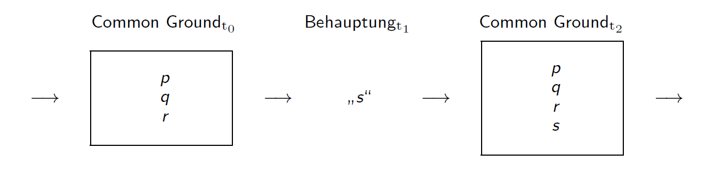

# Präsuppositionen & Konversation

## Bestimmte Kennzeichnungen revisited

1. Der Rektor der Uni Wien ist weise.
2. Der gegenwärtige König von Frankreich ist weise.

1) kann nicht angemessen (felicitous) geäüßert werden, ohne dass SprecherIn und HörerIn annehmen,d ass es einen Rektor der Uni Wien gibt

1. a) Es gibt einen Rektor der Uni Wien.
2. a) Es gibt einen gegenwärtigen König von Frankreich

3.  \# Die Uni Wien hat keinen Rektor. (Doch) der Rektor der Uni Wien ist weise.

Eine Äußerung von 1 setzt 1a voraus (präsupponiert), sagt 1a aber nicht aus.

-> Wie können wir Präsuppositionen vom ausgesagten sprachlichen Gehalt unterscheiden?

## Konstanz unter Negation

2. Der gegenwärtige König von Frankreich ist weise.
5. Der gegenwärtige König von Frankreich ist nicht weise.

Sowohl Aussage 2 als auch 5 präsupponieren beide, dass es einen gegenwärtigen König von Frankreich gibt.

**Konstanz der Negation (informal)**
> Wenn ein Satz eine Präsupposition hat, dann hat die Negation dieses Satz ebenso diese Präsupposition.

## Semantische Präsupposition

2. Der gegenwärtige König von Frankreich ist weise.
  * Was passiert wenn ein Satz eine falsche Präsupposition hat?
  * nach Frege hat 2 keinen Wahrheitswert, da seine Präsupposition, dass es einen ggw. König von Frankreich gibt, falsch ist. Nach Frege ist 2 weder wahr noch falsch.

*Semantische Präsupposition*
S sei ein Satz, der Proposition P präsupponiert, dann gilt:

1. In allen Situationen, in denen S wahr ist, ist P wahr.
2. In allen Situationen, in denen S falsch ist, ist P wahr.
3. In einer Situation, in der P wahr ist, kann S entweder wahr oder falsch sein.
4. In allen Situationen, in denen P falsch ist, ist S weder wahr noch falsch.

## Präsupposition vs Folge (Entailment)

6. Der Rektor besitzt 37 Krawatten.
7. Der Rektor besitzt 36 Krawatten.
8. Der Rektor besitzt keine 37 Krawatten.
  * 6 hat 7 als Folge
  * Der negierte Satz 8 hat aber 7 nicht als Folge. Wenn der Rektor keine 37 Krawatten besitzt, ist es sehr wohl möglich, dass er z.B. nur eine Krawatte besitzt.
  * Unter der Negation eines Satzes fallen dessen Folgen weg
  * Negation liefert einen guten Test dafür, ob eine Proposition P eine behauptete Folge oder eine Präsupposition von Satz S ist.

**Negation als Test zur Unterscheidung von Präsupposition und Folge**
> Wenn P eine Präsupposition von S ist, dann ist P auch wahr, wenn Nicht-S wahr ist. Wenn P eine Folge von S ist, dann kann P falsch sein, wenn Nicht-S wahr ist.

## Präsuppositionstrigger

> Präsuppositionstrigger sind Ausdrücke oder Konstruktionen, die aufgrund ihrer konventionellen, semantischen Bedeutung einer Präsupposition mit sich bringen.

  * Bestimmte Artikel - Es existiert exakt ein so bezeichneter Gegenstand
  * Faktive Verben ('Ich weiß..', 'Ich erinnere mich..') - Die Wahrheit wird präsupponiert
  * Iterative (wieder, zurückkehren,.. ) - Eine vergangene Handlung wird präsupponiert
  * Verben der Zustandsänderung (aufhören, öffnen,..)
  * Cleft-Konstruktionen (Es war... der.., Was du brauchst ist...)
  * Temporale Nebensätze mit Konjunktionen (bevor, seitdem,..)

## Annullierbarkeit & Aussetzung

Ein Problem für die semantische Analyse von Präsuppositionen:
* Unter bestimten bedingungen sind Präsuppositionen annullierbar (defeasible) oder können ausgesetzt (suspended) werden. Dies ist aber nach der semantischen Analyse unmöglich.

**Annullierung**
* Der gegenwärtige König von Frankreich ist nicht weiße - es gibt keinen König von Frankreich!

**Aussetzung**
* Tucker hat aufgehört zu rauchen, falls er je geraucht hat.

## Behaupten & Common Ground

* Jede Behauptung (assertion) geschieht gegenüber dem Common Ground, der Hörerinnen erlaubt, die Behauptung zu interpretieren.

* Es hängt u.a. vom Common Ground ab, ob eine Behauptung linguistisch 'akzeptabel' (felicitous) ist.

* Es hängt von den Propositionen im Common Ground ab, ob eine Behauptung mit einem Präsuppositionstrigger akzeptabel ist.

*Die Gewitterfront erreicht uns in etwa einer Stunde.*
* Akzeptabel wenn es Common Ground ist, dass es eine Gewitterfront gibt.
* Inakzeptabel wenn es ohne diese bestehende Annahme geschieht
* Erfolgreiche Behauptungen werden zum Common Ground hinzugefügt

 

* Der Common Ground beeinflusst, was angemessen behauptbar ist.
* Was erfolgreich behauptet wird, beeinflusst den Common Ground für zukünftige Sprechakte.

-> Beruht auf Darstellung von Grice's Konzept der Kooperativität von Konversation

## Aussagen/Behaupten und Präsupponieren
 

**Präsupponierter Gehalt**
* vorausgesetzte Information
* im 'Hintergrund'

**Ausgesagter Gehalt**
* neue Information
* im 'Vordergrund'
* fokussiert

## Problem für pragmatischen Ansatz

* Sprecher können, unter gewissen Umständen, mit Präsuppositionen neue Informationen einführen.

* Wie kann der pragmatische Ansatz die Angemessenheit solcher Behauptungen selbst in Kontexten, in denen die Präsuppositionen vorher noch nicht im Common Ground waren, erklären?

**Akkommodation**
> HörerInnen sind aufgefordert, neue informationen, die mithilfe von Präsuppositionen eingeführt werden, als vorausgesetzt zu behandeln und in den Common Ground mit auf zu nehmen, zu akkommodieren.

Für Lewis ist Akkommodation eine der Konversationsregeln.
