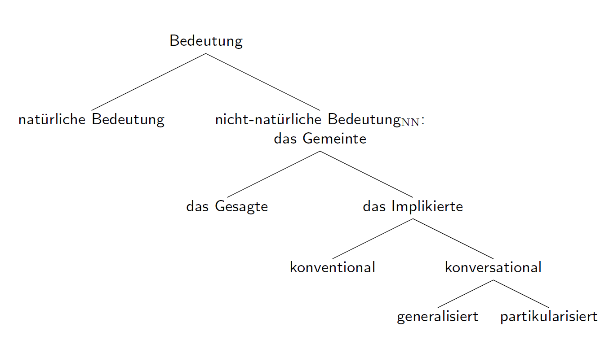

# Implikaturen

## Wiederholung - Semantik, Pragmatik

**Semantik**
>Semantik untersucht die (wörtliche) Bedeutung sprachlicher Ausdrücke.

**Pragmatik**
> Pragmatik untersucht den Gebrauch sprachlicher Ausdrücke, die kontextabhängige, nicht-wörtliche Bedeutung eines verwendeten Ausdrucks in einer konkreten Situation, die BEdingungen für ihrer Entstehen und ihren kommunikativen Effekt.

### Grices Auffassung

Semantische Satzbedeutung ist der minimale Inhalt, der gebraucht wird, um mit allgemeinen pragmatischen Prinzipien die Bedeutungsphänomene in der Kommunikation zu erklären. Das heißt,

* Semantik betrifft das, was (aus)gesagt wird ("what is said").
* Pragmatik betrifft das, was nur implikiert wird ("what is implicated").

> Zusammen ergeben das, was gesagt wird, und das, was implikiert wird, das, was von dem Sprecher gemeint wird ("what is meant").

Grice selbst hat nicht unbedingt die Zuteilung in Semantik und Pragmatik getroffen, sondern nur 'what is said' and 'what is implicated' unterschieden hat.

> Sprecherinnen sind in der Lage, alle möglichen Dinge sprachlich zu vermitteln (convey) - Dinge, welche die verwendeten Sätze aber nicht wörtlich bedeuten (literally mean) Wie machen sie das?

## Kommunikation als Kooperation

**Das allgemeine Kooperationsprinzip (KP) in der (rationalen) Kommunikation**

    "Mache deinen Gesprächsbeitrag jeweils so, wie es von dem akzeptierten Zweck
     oder der akzeptierten Richtung des Gesprächs, an dem du teilnimmst, gerade
     verlangt wird."

### Maximen des Kooperationsprinzips

1. Maxim of Quantity
  * Make your contribution as informative as is required (for the current purposes of the exchange)
  * Do not make your contribution more informative than is required

2. Maxim of Quality
  * Do not say what you believe to be false
  * Do not say that for which you lack adquate evidence

3. Maxim of Relation
  * Be relevant

4. Maxim of Manner
  * Avoid obscurity of expression
  * Avoid ambiguity
  * Be brief
  * Be orderly

### Arten, Maxime nicht zu erfüllen

1. Eine Maxime verletzen (violate): still und undemonstrativ, irreführend
2. Aussteigen (opt out) - 'Mehr kann ich nicht sagen...'
3. Kollision (clash) - Bei Maximen, die im Konflikt stehen, muss eine verletzt werden
4. Verstoßen (flout) - Eine Maxime offensichtlich nicht erfüllen

Das Ergebnis eines Verstoßens ist oftmals eine Implikatur, die die Kommunikation wieder kooperativ macht.

### Gesagtes und Implikiertes

**Das Gesagte / what is said**
>Das, was mit einer Äußerung gesagt ist, ist eng an die wörtliche, konventionelle (semantische) Bedeutung der geäußerten Wörter geknüpft-

**Implikatur / das Implikierte**
> Das, was mit einer Äußerung implikiert ist, ist eine Proposition. die von der/dem SprecherIn absichtsvoll mit der Äußerung kommuniziert wird, aber nicht zu dem gehört, was der geäußerte Satz in dem Kontext sagt.

**Das Gemeinte / Sprecherbedeutung (nn) / what is meant**
> Das, was mit einer Äußerung gemeint ist, umfasst sowohl das Gesagte als auch das Implikierte

## Konversationale Implikatur

**Konversationale Implikatur**
>Eine konversationale Implikatur ist eine Proposition, die mit einer Äußerung mithilfe dessen, was gesagt wird, und mithilfe von allgemeinen Tatsachen zum Äußerungskontext und den Konversationsmaximen gemeint/kommuniziert ist.

**Voraussetzungen**

1. Vom Hörer ist anzunehmen, dass der Sprecher die Konversationsmaximen beachtet
2. Dem Hörer ist bewusst, dass q, ist nötig, um den Umstand, dass er sagt, also sagt er, dass p, um mit der in 1 erwähnten Annahme in Übereinstimmung zu bringen
3. Der Sprecher glaubt, dass der Hörer in der lage ist, die Annahme intuitiv zu erfassen

### Partikularisierte vs generalisierte konversationale Implikaturen

1. What time is it?
2. Some of the guests are already leaving
  * PKI: 'It must be late'
  * GKI: 'Not all of the guests are already leaving'

1. Where's John?
2. Some of the guests are already leaving.
  * PKI: 'Perhaps John has already left.'
  * GKI: 'Not all of the guests are already leaving.'

**Partikularisierte konversationale Implikaturen (PKI)**
> Particularized conversational implicatures sind Implikaturen, die nur aufgrund besonderer Umstände des Äußerungskontexts von einer Äu0erung ausgehen.

**Gemeralisierte konversationale Implikaturen**
> Generalized conversational implicatures sind Implikaturen, die von der Äußerung eines Satzes normalerweise ausgehen.

### Eigenschaften konversationaler Implikaturen

Was zeichnet konversationale Implikaturen aus? Warum sind sie nicht einfach Teil der wörtlichen Bedeutung?

1. Stornierbarkeit - KIs können widerspruchsfrei storniert oder annuliert werden (explizit oder kontextuell)
2. Ermittelbarkeit - KIs können (durch Schließen) ermittelt werden
3. Nicht-Abtrennbarkeit

## Konventionale Implikatur

1. Anna ist reich und sie ist unglücklich.
2. Anna ist reich, aber sie ist unglücklich.
  * Zwischen Reichtum und Unglück besteht ein Gegensatz

**Konventionale Implikatur**
>Eine konventionale Implikatur wird durch die wörtlichen, konventionellen Bedeutungen der verwendeten Wörter bestimmt

1. Nicht-Stornierbarkeit
2. Nicht-Ermittlbarkeit
3. Abtrennbarkeit

## Grices Modell der Bedeutung

 
