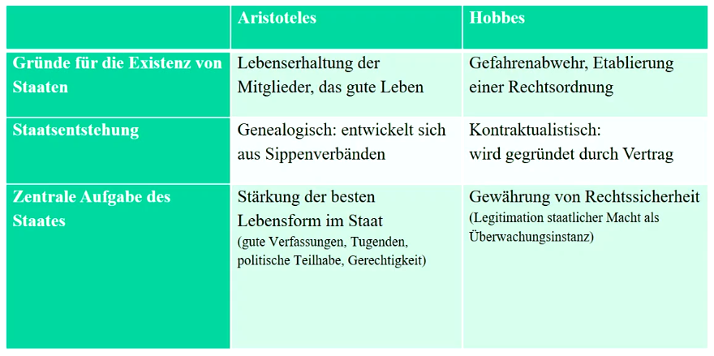

# Politische Philosophie und Staatstheorie - Aristoteles, Hobbes

Was macht die normative pol. Philosophie aus? Wie sollte ein politisches System sein?

## Aristoteles - Staat

Ethik ist die Propädeutik der Politik

Wichtige Fragen werden angeschnitten: Staatsform, Bürger, Eigentum,..

Vormoderne Konzeption des Staates - Privatperson und pol. Bürger nicht getrennt

### Grundgedanken

1. Erklärung des Staates mittels seiner Zwecke = teleologisches Argument

Zwecke sind:
- Bedürfnisbefriedigung aller Bürger
- das gute, tugendhafte Leben

Staat als Art von Gemeinschaft mit Zweck, ein Gut zu erlangen

Staat nicht als Regierung/Regierende

Aristoteles als Realist

2. Erklärung des Staates hinsichtlich seiner Entstehung = genealogisches Argument

- Haus bestehend aus Herr und Sklave, Mann und Frau
- Dorf, Kolonie des Hauses; Bedürfnisse über alltäglichen Bedarf hinaus
- Staat (vollendete Gemeinschaft) aus Dörfen, um des Lebens und Guten Lebens willen bestehend

3. Erklärung des Staates hinsichtlich seiner Naturgemäßheit = naturalistisches Argument

- Staat ist der Natur des Menschen gemäße Einrichtung
- Staat st von Natur aus ursprünglicher als das Haus jedes einzelnen

**Thesen zum Aristotelischen Staatsverständnis**

1. Der Staat ist notwendig, um Lebensbedürfnisse aller zu erfüllen. Eigentlicher Zweck ist das gute Leben.
2. Das gute Leben ist ein tugendhaftes Leben. Nur als Bürgerinnen und Bürger können Menschen ein ethisch gutes Leben führen.
3. Bürger sind Mitglieder des Staates; zugleich rechtmäßige Autoren von Gesetzen (antike Demokratie)

Bürger nicht als Rechtstitel, Abstammungsrecht oder Geburtsort SONDERN die Möglichkeit der Teilnahme an der beratenden Staatsgewalt.

**Verfassungslehre**

Unterscheidung von Verfassungstypen anhand zwei Kriterien

- Gute Verfassungen = dienen dem Wohl der Bürger, nicht dem Wohl des Herrschers
- Numerisch: Die Anzahl der an der Regierung Beteiligten

## Hobbes

Ohne Staat gibt es keine Gemeinschaft außerhalb der Familie

1. Der Staat ist notwendig zur Gefahrenabwehr
2. Die Gefahr geht von den Menschen aus, solange sie in einer staatenlosen Situation leben
3. Der Staat wird errichtet mittels eines Vertrages, welcher die

* Konstruktion eines vor-gesellschaftlichen und vor-rechtlichen Zustandes: den Naturzustand (Konflikte durch Konkurrenz, Unsicherheit, Ruhmsucht)

* Zwangsläufige Ekskalation: Krieg aller gegen alle (Im Kriegszustand gibt es keine Ungerechtigkeit)

* In einem solchen Naturzustand gilt das Naturrecht (erhalten der eigenen natur mit allen Mitteln)
* Dennoch gibt es Naturgesetze als Vernunftgesetze
  - jeder sollte nach Frieden streben
  - verzichten, wenn andere es auch tun

* Möglichkeit, einen Vertrag abzuschließen (Ordnung zum Vorteil aller); durch höhere Macht (Leviathan) geregelt

## Aristoteles vs Hobbes

 
